```mermaid
erDiagram

    %% ══════════════════════════════════════════════
    %% CORE USER TABLE (extends Django AbstractUser)
    %% ══════════════════════════════════════════════

    USER {
        varchar roll_number PK "Primary Key — custom (e.g. STU1001, FAC001)"
        varchar username UK "Django auth username (unique)"
        varchar email "User email"
        varchar password "Hashed password (Django)"
        varchar first_name "First name"
        varchar last_name "Last name"
        boolean is_active "Account active flag"
        boolean is_staff "Django admin access"
        boolean is_superuser "Full Django admin"
        datetime date_joined "Auto-set on creation"
        datetime last_login "Last login timestamp"
        varchar role "Enum: student | faculty | admin"
        varchar rfid_tag "RFID card UID (nullable)"
        varchar device_id "Bound mobile device ID (nullable)"
        varchar department "Department code e.g. ECE, CSE"
        int year_of_joining "Academic year 1-4 (nullable)"
        varchar image_path "Face enrolment status / path"
    }

    %% ══════════════════════════════════════════════
    %% PROXY MODELS (same table, filtered views)
    %% ══════════════════════════════════════════════

    STUDENT {
        varchar roll_number PK "Proxy of USER where role=student"
    }

    FACULTY {
        varchar roll_number PK "Proxy of USER where role=faculty"
    }

    %% ══════════════════════════════════════════════
    %% GEOFENCING
    %% ══════════════════════════════════════════════

    CAMPUS_ZONE {
        int id PK "Auto-increment"
        varchar name "Zone name e.g. Main Campus"
        json polygon_coordinates "Array of lat/lng points defining boundary"
    }

    LOCATION_RECORD {
        int id PK "Auto-increment"
        varchar student_id FK "→ USER.roll_number (role=student)"
        float latitude "GPS latitude"
        float longitude "GPS longitude"
        datetime timestamp "Auto-set on creation"
        boolean in_campus "True if inside polygon boundary"
        int current_zone_id FK "→ CAMPUS_ZONE.id (nullable)"
    }

    %% ══════════════════════════════════════════════
    %% LEGACY ATTENDANCE (flat, subject as string)
    %% ══════════════════════════════════════════════

    ATTENDANCE_LEGACY {
        int id PK "Auto-increment"
        varchar student_id FK "→ USER.roll_number (role=student)"
        varchar subject "Free-text subject code (legacy)"
        date date "Attendance date"
        varchar status "Enum: Present | Absent"
    }

    %% ══════════════════════════════════════════════
    %% NOTES / STUDY MATERIAL
    %% ══════════════════════════════════════════════

    NOTE {
        int id PK "Auto-increment"
        varchar title "Document title"
        varchar subject "Subject reference (free text)"
        varchar file_url "URL to uploaded material"
        varchar uploaded_by_id FK "→ USER.roll_number (role=faculty, nullable)"
        datetime uploaded_at "Auto-set on creation"
    }

    %% ══════════════════════════════════════════════
    %% SYLLABUS MASTER CATALOG (reference table)
    %% ══════════════════════════════════════════════

    SUBJECT_CATALOG {
        varchar subject_code PK "Regulated code e.g. EC2201"
        varchar subject_name "Full name e.g. Signals and Systems"
        varchar department "Department: ECE / CSE / IT etc."
        int year "Academic year: 1 / 2 / 3 / 4"
        varchar semester "Enum: Odd | Even"
    }

    %% ══════════════════════════════════════════════
    %% FACULTY-CREATED SUBJECT (active teaching unit)
    %% ══════════════════════════════════════════════

    SUBJECT {
        varchar subject_code PK "Matches SUBJECT_CATALOG code"
        varchar subject_name "Subject name (from catalog)"
        varchar department "Department"
        int year "Academic year: 1-4"
        varchar faculty_id FK "→ USER.roll_number (role=faculty)"
    }

    %% ══════════════════════════════════════════════
    %% STUDENT ENROLLMENT INTO SUBJECT
    %% ══════════════════════════════════════════════

    STUDENT_SUBJECT_ENROLLMENT {
        int id PK "Auto-increment"
        varchar student_id FK "→ USER.roll_number (role=student)"
        varchar subject_code FK "→ SUBJECT.subject_code"
        varchar semester "e.g. Odd 2025-26 (nullable)"
        boolean is_active "True = currently enrolled"
    }

    %% ══════════════════════════════════════════════
    %% ATTENDANCE SESSION (one per class held)
    %% ══════════════════════════════════════════════

    ATTENDANCE_SESSION {
        uuid session_id PK "UUID auto-generated"
        varchar subject_code FK "→ SUBJECT.subject_code"
        varchar faculty_id FK "→ USER.roll_number (role=faculty)"
        varchar department "Denormalized from subject"
        int year "Denormalized from subject"
        date session_date "Auto-set: date session started"
        datetime start_time "Auto-set: when session opened"
        datetime end_time "Nullable: when session finalized"
        varchar status "Enum: Active | Finalized"
        int expected_count "Total enrolled students at start"
        int present_count "Total marked Present (bulk calc)"
        int absent_count "Total marked Absent (bulk calc)"
    }

    %% ══════════════════════════════════════════════
    %% ATTENDANCE RECORD (one row per student per session)
    %% ══════════════════════════════════════════════

    ATTENDANCE_RECORD {
        int id PK "Auto-increment"
        uuid session_id FK "→ ATTENDANCE_SESSION.session_id"
        varchar student_id FK "→ USER.roll_number (role=student)"
        varchar status "Enum: Present | Absent | Excused"
        datetime marked_at "Auto-set on insert"
        float confidence "Face recognition confidence 0.0-1.0 (nullable)"
        varchar spoof_status "LIVE / SPOOF / N/A (nullable)"
    }

    %% ══════════════════════════════════════════════
    %% RELATIONSHIPS
    %% ══════════════════════════════════════════════

    USER ||--o{ LOCATION_RECORD : "has many (as student)"
    CAMPUS_ZONE ||--o{ LOCATION_RECORD : "contains"

    USER ||--o{ ATTENDANCE_LEGACY : "has many (as student)"
    USER ||--o{ NOTE : "uploads (as faculty)"

    USER ||--o{ SUBJECT : "teaches (as faculty)"
    USER ||--o{ STUDENT_SUBJECT_ENROLLMENT : "enrolled in (as student)"
    SUBJECT ||--o{ STUDENT_SUBJECT_ENROLLMENT : "has many enrollments"

    USER ||--o{ ATTENDANCE_SESSION : "conducts (as faculty)"
    SUBJECT ||--o{ ATTENDANCE_SESSION : "has many sessions"

    ATTENDANCE_SESSION ||--o{ ATTENDANCE_RECORD : "contains many records"
    USER ||--o{ ATTENDANCE_RECORD : "has record (as student)"

    SUBJECT_CATALOG ||--o{ SUBJECT : "referenced by (same code)"

    STUDENT ||--|| USER : "proxy view (role=student)"
    FACULTY ||--|| USER : "proxy view (role=faculty)"
```

# 📊 Smart Campus Attendance System — Complete ER Diagram

> All tables, all columns, all relationships. Generated from `backend/api/models.py`.

---

---

## Table Summary

| Table | Rows Purpose | PK Type |
|---|---|---|
| **USER** | All users — students, faculty, admin | `roll_number` (custom varchar) |
| **STUDENT** | Proxy view of USER (role=student) | — |
| **FACULTY** | Proxy view of USER (role=faculty) | — |
| **CAMPUS_ZONE** | Geofenced polygon boundaries | Auto int |
| **LOCATION_RECORD** | Real-time GPS pings from student devices | Auto int |
| **ATTENDANCE_LEGACY** | Old flat attendance log (pre-normalization) | Auto int |
| **NOTE** | Study material uploaded by faculty | Auto int |
| **SUBJECT_CATALOG** | Master regulated syllabus (reference only) | `subject_code` varchar |
| **SUBJECT** | Active teaching unit created by faculty | `subject_code` varchar |
| **STUDENT_SUBJECT_ENROLLMENT** | Which students are enrolled in which subject | Auto int |
| **ATTENDANCE_SESSION** | One session = one class held | UUID |
| **ATTENDANCE_RECORD** | One row per student per session (Present/Absent) | Auto int |

---

## Key Constraints

| Constraint | Table | Columns |
|---|---|---|
| Unique Together | `STUDENT_SUBJECT_ENROLLMENT` | `(student_id, subject_code)` |
| Unique Together | `ATTENDANCE_RECORD` | `(session_id, student_id)` |
| Cascade Delete | `ATTENDANCE_SESSION` | on Subject deleted |
| Cascade Delete | `ATTENDANCE_RECORD` | on Session deleted |
| Set Null | `LOCATION_RECORD.current_zone` | on Zone deleted |
| Set Null | `NOTE.uploaded_by` | on Faculty deleted |
